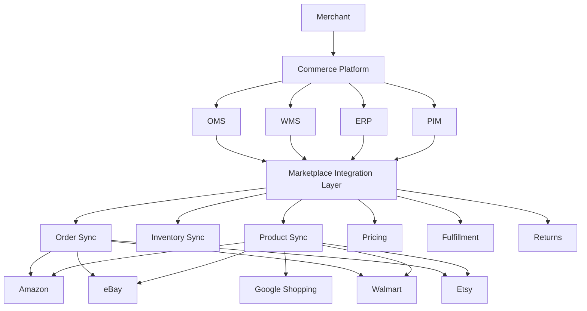
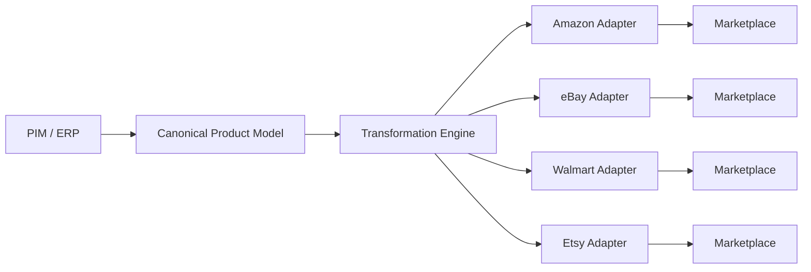
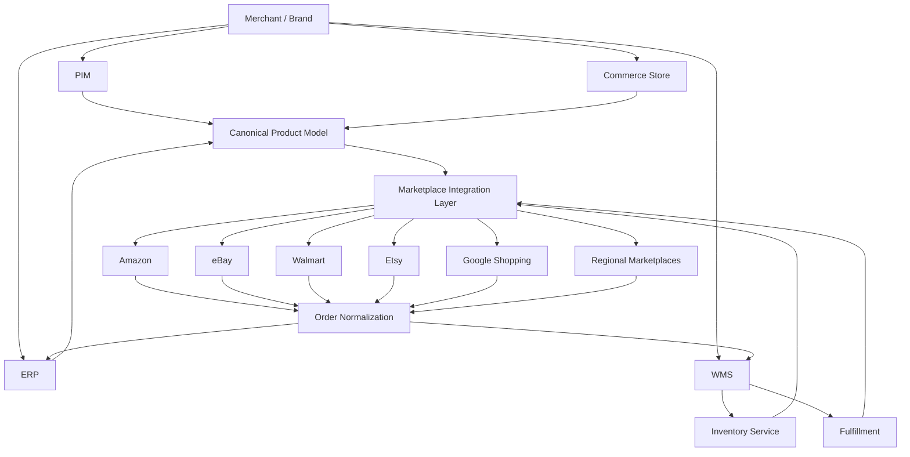
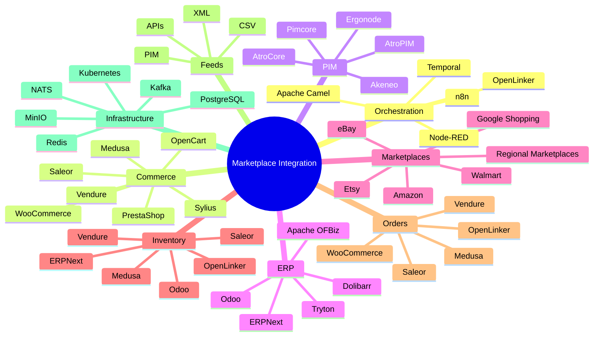

# Awesome-Marketplace-Integration-Platform

## 🛍️ Top Marketplace Integration Platforms & Open-Source Alternatives

> A curated list of **marketplace integration platforms, multichannel commerce software, product-feed management systems, order/inventory synchronization platforms and open-source alternatives** for selling across Amazon, eBay, Walmart, Etsy, Google Shopping, Shopify, regional marketplaces and other sales channels.

Marketplace integration platforms sit between a merchant's commerce stack and external sales channels, synchronizing products, listings, prices, inventory, orders, fulfillment and returns.

This repository focuses primarily on **open-source and self-hostable alternatives**, while maintaining a separate list of SaaS/hosted platforms such as ChannelEngine, Linnworks, Rithum (ChannelAdvisor), CedCommerce, Shoppingfeed, Channable, Pipe17, Zentail and API2Cart.

A typical marketplace integration layer looks like:

```text
                         MERCHANT
                            │
       ┌────────────────────┼────────────────────┐
       │                    │                    │
       ▼                    ▼                    ▼
      ERP                  PIM                  WMS
       │                    │                    │
       └────────────────────┼────────────────────┘
                            │
                            ▼
                  MARKETPLACE INTEGRATION
                            │
          ┌─────────────────┼─────────────────┐
          │                 │                 │
          ▼                 ▼                 ▼
       Amazon             eBay            Walmart
          │                 │                 │
          ▼                 ▼                 ▼
       Orders            Orders            Orders
          │                 │                 │
          └─────────────────┼─────────────────┘
                            ▼
                       OMS / ERP
```

Modern channel managers typically act as middleware between a merchant's ERP, OMS, PIM, WMS or webstore and marketplaces, keeping product, price, inventory, fulfillment and order information synchronized. ChannelEngine's current documentation describes this middleware role explicitly, while its Channel API supports products, orders, shipments, cancellations and returns.

---

## 📑 Table of Contents

* [☁️ SaaS/Hosted Platforms](#️-saashosted-platforms)
* [🌍 Open-Source](#-open-source)
* [🔄 Open-Source Marketplace Orchestration](#-open-source-marketplace-orchestration)
* [🛒 Open-Source E-Commerce Platforms](#-open-source-e-commerce-platforms)
* [📦 Open-Source Product & Catalog Management](#-open-source-product--catalog-management)
* [🔌 Open-Source Integration & Automation](#-open-source-integration--automation)
* [📡 Open-Source Marketplace & Channel Connectors](#-open-source-marketplace--channel-connectors)
* [📋 Open-Source Product Feed Management](#-open-source-product-feed-management)
* [📦 Open-Source Order & Inventory Management](#-open-source-order--inventory-management)
* [🚚 Open-Source Shipping & Fulfillment](#-open-source-shipping--fulfillment)
* [🧾 Open-Source ERP & Commerce Backends](#-open-source-erp--commerce-backends)
* [🧩 Commercial Platform → Open-Source Equivalent](#-commercial-platform--open-source-equivalent)
* [🏗️ Marketplace Integration Architecture](#️-marketplace-integration-architecture)
* [🔄 Open-Source Multichannel Architecture](#-open-source-multichannel-architecture)
* [📦 Product Synchronization Architecture](#-product-synchronization-architecture)
* [📋 Order Synchronization Architecture](#-order-synchronization-architecture)
* [⚖️ Commercial vs Open-Source](#️-commercial-vs-open-source)
* [🚀 Recommended Open-Source Stacks](#-recommended-open-source-stacks)
* [📊 Marketplace Integration Comparison](#-marketplace-integration-comparison)
* [🎯 Recommended Projects by Use Case](#-recommended-projects-by-use-case)
* [🏢 Building a ChannelEngine Alternative](#-building-a-channelengine-alternative)
* [🏪 Building a Multichannel Commerce Platform](#-building-a-multichannel-commerce-platform)
* [🌐 Open-Source Marketplace Integration Landscape](#-open-source-marketplace-integration-landscape)
* [🧠 Why Open-Source Marketplace Integration Matters](#-why-open-source-marketplace-integration-matters)
* [🤝 Contributing](#-contributing)
* [⚠️ Disclaimer](#️-disclaimer)

---

# ☁️ SaaS/Hosted Platforms

Commercial marketplace integration platforms provide prebuilt connectors, catalog synchronization, order management, inventory synchronization, marketplace listing management and feed automation.

| Platform                                          | Company       | Primary Focus                 | Key Capabilities                                                                       |
| ------------------------------------------------- | ------------- | ----------------------------- | -------------------------------------------------------------------------------------- |
| [ChannelEngine](https://www.channelengine.net/)   | ChannelEngine | Marketplace management        | Product listings, inventory, orders, pricing, fulfillment and marketplace integrations |
| [Linnworks](https://www.linnworks.com/)           | Linnworks     | Multichannel commerce         | Inventory, orders, fulfillment, warehouse and marketplace management                   |
| [Rithum](https://www.rithum.com/)                 | Rithum        | Multichannel commerce         | Marketplace connectivity, product data, orders, inventory and retail relationships     |
| [ChannelAdvisor](https://www.channeladvisor.com/) | Rithum        | Marketplace management        | Marketplace listings, orders, inventory, feeds and commerce automation                 |
| [CedCommerce](https://cedcommerce.com/)           | CedCommerce   | Marketplace integrations      | Marketplace connectors for ecommerce platforms and sellers                             |
| [Shoppingfeed](https://www.shoppingfeed.com/)     | Shoppingfeed  | Product feeds                 | Marketplace and shopping-channel feed management                                       |
| [Channable](https://www.channable.com/)           | Channable     | Feed & marketplace automation | Product feeds, marketplace integrations, PPC automation and rules                      |
| [Pipe17](https://pipe17.com/)                     | Pipe17        | Commerce connectivity         | Orders, products, inventory, fulfillment and ERP/commerce integrations                 |
| [Zentail](https://www.zentail.com/)               | Zentail       | Multichannel commerce         | Listings, catalog, inventory, orders and marketplace management                        |
| [API2Cart](https://api2cart.com/)                 | API2Cart      | Ecommerce integration API     | Unified API for ecommerce platforms                                                    |
| [Feedonomics](https://feedonomics.com/)           | Feedonomics   | Feed management               | Product feeds and channel optimization                                                 |
| [Productsup](https://www.productsup.com/)         | Productsup    | Product-to-consumer           | Product data, feeds, marketplaces and commerce channels                                |
| [Lengow](https://www.lengow.com/)                 | Lengow        | Ecommerce feed management     | Marketplace, comparison-shopping and advertising channels                              |
| [ChannelDock](https://www.channeldock.com/)       | ChannelDock   | Multichannel selling          | Marketplace synchronization and order management                                       |
| [BaseLinker](https://baselinker.com/)             | BaseLinker    | Multichannel commerce         | Marketplace, ecommerce, inventory and order management                                 |
| [Rithum](https://www.rithum.com/)                 | Rithum        | Commerce network              | Retail, marketplace and supplier connectivity                                          |
| [Mirakl Connect](https://www.mirakl.com/)         | Mirakl        | Marketplace ecosystem         | Marketplace connections, catalog, orders and seller connectivity                       |
| [Akeneo](https://www.akeneo.com/)                 | Akeneo        | PIM                           | Product information management and channel syndication                                 |
| [Salsify](https://www.salsify.com/)               | Salsify       | Product experience            | Product content, syndication and digital shelf management                              |

Mirakl Connect provides a unified API for managing products, inventories, orders and shipments across connected Mirakl-powered stores.

ChannelEngine's API similarly supports marketplace/channel synchronization around products, orders, shipments, cancellations and returns.

---

# 🌍 Open-Source

There is currently no single dominant open-source project that reproduces the entire feature set of a mature platform such as ChannelEngine, Linnworks or Rithum.

Instead, an open-source marketplace integration platform can be assembled from:

```text
                 OPEN-SOURCE MULTICHANNEL COMMERCE
                              │
        ┌─────────────────────┼─────────────────────┐
        │                     │                     │
        ▼                     ▼                     ▼
     Catalog               Products             Inventory
        │                     │                     │
        └─────────────────────┼─────────────────────┘
                              │
                              ▼
                    Marketplace Connectors
                              │
          ┌───────────────────┼───────────────────┐
          ▼                   ▼                   ▼
       Amazon               eBay               Walmart
          │                   │                   │
          └───────────────────┼───────────────────┘
                              ▼
                           Orders
                              │
                              ▼
                         Fulfillment
                              │
                              ▼
                         Accounting
```

The strongest direct open-source project identified for this category is **OpenLinker**, a self-hosted, API-first marketplace orchestration platform designed specifically to synchronize products, inventory and orders across shops and marketplaces. It is currently alpha/pre-1.0 and uses an Apache-2.0 license.

---

# 🔄 Open-Source Marketplace Orchestration

## OpenLinker

[OpenLinker](https://github.com/openlinker-project/openlinker) is currently one of the closest open-source projects to the **channel-manager / marketplace-orchestration** category.

It provides:

* Product synchronization
* Inventory synchronization
* Order synchronization
* Marketplace listings
* Shipping integrations
* Multiple stores
* Marketplace adapters
* Plugin-based integrations
* OAuth connections
* Credential management
* Retry handling
* Webhooks
* Self-hosting

Current integrations include PrestaShop, WooCommerce, Allegro and Erli, with additional integrations such as Shopify, BigCommerce, Magento, Amazon and eBay listed on its roadmap.

```text
                         OpenLinker
                             │
              ┌──────────────┼──────────────┐
              │              │              │
              ▼              ▼              ▼
          Products       Inventory         Orders
              │              │              │
              └──────────────┼──────────────┘
                             │
                  ┌──────────┴──────────┐
                  ▼                     ▼
               Shops              Marketplaces
                  │                     │
          ┌───────┼───────┐       ┌────┼────┐
          ▼       ▼       ▼       ▼         ▼
      PrestaShop WooCommerce Allegro    Erli
```

OpenLinker explicitly positions itself as an alternative to SaaS channel managers and custom marketplace scripts, with a plugin architecture for adding new integrations.

---

# 🛒 Open-Source E-Commerce Platforms

These platforms are not direct ChannelEngine replacements. Instead, they provide the **commerce system that marketplace integration software connects to**.

| Project                                                   | Description                      | Marketplace Relevance                 |
| --------------------------------------------------------- | -------------------------------- | ------------------------------------- |
| [Medusa](https://github.com/medusajs/medusa)              | Headless commerce platform       | API-first commerce backend            |
| [Saleor](https://github.com/saleor/saleor)                | GraphQL-native headless commerce | Native multichannel architecture      |
| [Vendure](https://github.com/vendurehq/vendure)           | TypeScript headless commerce     | Multi-channel and marketplace support |
| [Sylius](https://github.com/Sylius/Sylius)                | Symfony ecommerce framework      | Highly customizable commerce backend  |
| [WooCommerce](https://github.com/woocommerce/woocommerce) | Open-source ecommerce            | Huge connector ecosystem              |
| [PrestaShop](https://github.com/PrestaShop/PrestaShop)    | Open-source ecommerce            | Marketplace integrations              |
| [OpenCart](https://github.com/opencart/opencart)          | Open-source ecommerce            | Marketplace extensions                |
| [Bagisto](https://github.com/bagisto/bagisto)             | Laravel ecommerce                | Multi-channel integrations            |
| [Spree Commerce](https://github.com/spree/spree)          | Headless commerce                | API-driven ecommerce                  |
| [Shopware](https://github.com/shopware/shopware)          | Open commerce platform           | Enterprise integrations               |

Saleor is API-only, GraphQL-native and supports native multichannel concepts, making it particularly useful as the commerce backend underneath a custom marketplace integration layer.

Vendure similarly provides a plugin-first, TypeScript/GraphQL architecture with support for D2C, B2B, marketplace and omnichannel use cases.

Sylius is an open-source ecommerce framework built on Symfony with a REST API designed for integrations and customized commerce applications.

---

# 📦 Open-Source Product & Catalog Management

Marketplace integration requires a canonical product catalog.

| Project                                                   | Primary Role                    |
| --------------------------------------------------------- | ------------------------------- |
| [Akeneo PIM](https://github.com/akeneo/pim-community-dev) | Product information management  |
| [AtroPIM](https://github.com/atrocore/atropim)            | Open-source PIM                 |
| [AtroCore](https://github.com/atrocore/atrocore)          | Data management and integration |
| [Pimcore](https://github.com/pimcore/pimcore)             | PIM / MDM / DAM                 |
| [OpenPIM](https://github.com/openpim/openpim)             | Product information management  |
| [Ergonode](https://github.com/Ergonode/ergonode)          | Open-source PIM                 |
| [WooCommerce](https://github.com/woocommerce/woocommerce) | Product catalog                 |
| [Saleor](https://github.com/saleor/saleor)                | Product catalog                 |
| [Medusa](https://github.com/medusajs/medusa)              | Commerce catalog                |

AtroPIM exposes a REST API that can connect to external systems, sales channels and marketplaces, and supports HTTP-based import/export integrations.

AtroCore likewise describes itself as an open-source data-management and system-integration platform with REST/GraphQL connectivity.

---

# 🔌 Open-Source Integration & Automation

A marketplace connector is essentially an integration problem:

```text
Marketplace API
      │
      ▼
Authentication
      │
      ▼
Data Mapping
      │
      ▼
Normalization
      │
      ▼
Business Rules
      │
      ▼
Canonical Commerce Model
```

Useful open-source integration engines include:

| Project                                                      | Description                          |
| ------------------------------------------------------------ | ------------------------------------ |
| [Apache Camel](https://github.com/apache/camel)              | Enterprise integration framework     |
| [n8n](https://github.com/n8n-io/n8n)                         | Workflow automation                  |
| [Node-RED](https://github.com/node-red/node-red)             | Event-driven integration             |
| [Windmill](https://github.com/windmill-labs/windmill)        | Developer-oriented workflow platform |
| [Activepieces](https://github.com/activepieces/activepieces) | Open-source automation               |
| [Temporal](https://github.com/temporalio/temporal)           | Durable workflow orchestration       |
| [Kestra](https://github.com/kestra-io/kestra)                | Workflow orchestration               |
| [Apache Kafka](https://github.com/apache/kafka)              | Event streaming                      |
| [NATS](https://github.com/nats-io/nats-server)               | Messaging / eventing                 |

These are **integration building blocks**, not turnkey marketplace channel managers.

---

# 📡 Open-Source Marketplace & Channel Connectors

Marketplace connectors are often better treated as independent adapters.

```text
                   Canonical Product
                          │
             ┌────────────┼────────────┐
             ▼            ▼            ▼
          Amazon         eBay        Walmart
             │            │            │
             ▼            ▼            ▼
          Adapter       Adapter      Adapter
             │            │            │
             └────────────┼────────────┘
                          ▼
                    Marketplace APIs
```

Potential open-source connector foundations include:

| Project                                                        | Marketplace / Channel Capability |
| -------------------------------------------------------------- | -------------------------------- |
| [OpenLinker](https://github.com/openlinker-project/openlinker) | Marketplace/shop adapters        |
| [Saleor Apps](https://github.com/saleor/apps)                  | Commerce integrations            |
| [Medusa](https://github.com/medusajs/medusa)                   | Commerce integrations            |
| [Vendure](https://github.com/vendurehq/vendure)                | Plugin-based integrations        |
| [WooCommerce](https://github.com/woocommerce/woocommerce)      | Connector ecosystem              |
| [PrestaShop](https://github.com/PrestaShop/PrestaShop)         | Connector ecosystem              |
| [AtroPIM](https://github.com/atrocore/atropim)                 | Marketplace/channel integrations |
| [AtroCore](https://github.com/atrocore/atrocore)               | Integration framework            |

Saleor's app architecture separates integrations from the core platform, with apps communicating through GraphQL and webhooks.

---

# 📋 Open-Source Product Feed Management

Product feeds are another important alternative to direct marketplace connectors.

```text
                  Product Catalog
                         │
                         ▼
                    Feed Engine
                         │
           ┌─────────────┼─────────────┐
           ▼             ▼             ▼
        Google         Amazon        Meta
        Shopping      Marketplace    Catalog
           │             │             │
           ▼             ▼             ▼
       XML/CSV/API    XML/CSV/API   XML/CSV/API
```

Useful components:

| Project                                                        | Role                        |
| -------------------------------------------------------------- | --------------------------- |
| [AtroPIM](https://github.com/atrocore/atropim)                 | Product data management     |
| [AtroCore](https://github.com/atrocore/atrocore)               | Data integration            |
| [Akeneo PIM](https://github.com/akeneo/pim-community-dev)      | Product data                |
| [Pimcore](https://github.com/pimcore/pimcore)                  | PIM / DAM / MDM             |
| [Saleor Apps](https://github.com/saleor/apps)                  | Product feed integrations   |
| [OpenLinker](https://github.com/openlinker-project/openlinker) | Listing/orchestration layer |

---

# 📦 Open-Source Order & Inventory Management

A marketplace integration system must synchronize state in both directions.

```text
Marketplace
    │
    │ Orders
    ▼
Integration Layer
    │
    ▼
OMS / ERP
    │
    │ Inventory
    ▼
Integration Layer
    │
    ▼
Marketplace
```

Useful projects:

| Project                                                        | Role                          |
| -------------------------------------------------------------- | ----------------------------- |
| [OpenLinker](https://github.com/openlinker-project/openlinker) | Orders + inventory + listings |
| [Saleor](https://github.com/saleor/saleor)                     | Orders + inventory            |
| [Vendure](https://github.com/vendurehq/vendure)                | Orders + inventory            |
| [Medusa](https://github.com/medusajs/medusa)                   | Orders + inventory            |
| [WooCommerce](https://github.com/woocommerce/woocommerce)      | Orders + inventory            |
| [PrestaShop](https://github.com/PrestaShop/PrestaShop)         | Orders + inventory            |
| [ERPNext](https://github.com/frappe/erpnext)                   | Inventory + ERP               |
| [Odoo](https://github.com/odoo/odoo)                           | Inventory + ERP               |

OpenLinker's current architecture explicitly models catalog/inventory, orders and marketplace offers as separate capabilities implemented by integration plugins.

---

# 🚚 Open-Source Shipping & Fulfillment

Marketplace platforms frequently need to synchronize:

* Shipments
* Tracking numbers
* Shipping services
* Fulfillment status
* Returns
* Shipping labels

Useful open-source components:

| Project                                                        | Role                    |
| -------------------------------------------------------------- | ----------------------- |
| [OpenLinker](https://github.com/openlinker-project/openlinker) | Shipping adapters       |
| [ERPNext](https://github.com/frappe/erpnext)                   | Fulfillment / inventory |
| [Odoo](https://github.com/odoo/odoo)                           | Logistics               |
| [Saleor](https://github.com/saleor/saleor)                     | Shipping                |
| [Vendure](https://github.com/vendurehq/vendure)                | Shipping                |
| [Medusa](https://github.com/medusajs/medusa)                   | Fulfillment             |
| [OpenBoxes](https://github.com/openboxes/openboxes)            | Inventory / logistics   |

OpenLinker currently includes shipping capabilities through integrations such as InPost and DPD, alongside marketplace/shop synchronization.

---

# 🧾 Open-Source ERP & Commerce Backends

An ERP frequently becomes the **system of record** underneath a channel manager.

| Project                                                   | Focus                        |
| --------------------------------------------------------- | ---------------------------- |
| [ERPNext](https://github.com/frappe/erpnext)              | ERP / inventory / accounting |
| [Odoo Community](https://github.com/odoo/odoo)            | ERP / inventory / commerce   |
| [Dolibarr](https://github.com/Dolibarr/dolibarr)          | ERP / CRM                    |
| [Tryton](https://github.com/tryton/tryton)                | ERP framework                |
| [Apache OFBiz](https://github.com/apache/ofbiz-framework) | Enterprise commerce / ERP    |
| [iDempiere](https://github.com/idempiere/idempiere)       | ERP / CRM                    |
| [ERPNext Commerce](https://github.com/frappe/erpnext)     | Commerce + ERP               |

---

# 🧩 Commercial Platform → Open-Source Equivalent

| Commercial Platform                 | Open-Source Equivalent / Building Blocks                       |
| ----------------------------------- | -------------------------------------------------------------- |
| **ChannelEngine**                   | OpenLinker + Saleor/Vendure/Medusa + PIM                       |
| **Linnworks**                       | OpenLinker + ERPNext/Odoo + inventory + fulfillment            |
| **Rithum / ChannelAdvisor**         | OpenLinker + AtroPIM + ERP/OMS                                 |
| **CedCommerce**                     | OpenLinker + ecommerce-platform plugins + marketplace adapters |
| **Shoppingfeed**                    | AtroPIM + feed engine + marketplace adapters                   |
| **Channable**                       | AtroPIM + Apache Camel/n8n + feed-generation layer             |
| **Pipe17**                          | OpenLinker + Apache Camel + event-driven integration           |
| **Zentail**                         | OpenLinker + PIM + OMS + marketplace adapters                  |
| **API2Cart**                        | Unified API layer + ecommerce adapters                         |
| **Feedonomics**                     | AtroPIM/Pimcore + feed engine + channel adapters               |
| **Productsup**                      | AtroPIM/Pimcore + feed transformation + integration workflows  |
| **Lengow**                          | PIM + feed engine + marketplace adapters                       |
| **BaseLinker**                      | OpenLinker + ERPNext/Odoo + marketplace plugins                |
| **Mirakl Connect**                  | OpenLinker + marketplace connector framework                   |
| **Marketplace Channel Manager**     | OpenLinker + PIM + OMS                                         |
| **Multichannel Inventory Platform** | OpenLinker + ERPNext/Odoo                                      |
| **Marketplace Feed Platform**       | AtroPIM + Apache Camel + feed processors                       |
| **Commerce Integration API**        | API gateway + connector/adaptor layer                          |
| **Full Open-Source Stack**          | OpenLinker + AtroPIM + ERPNext + Saleor/Vendure                |

> These mappings are **architectural equivalents**, not claims that the open-source projects provide identical marketplace coverage or commercial integrations.

---

# 🏗️ Marketplace Integration Architecture



---

# 🔄 Open-Source Multichannel Architecture

```text
                         MERCHANT
                            │
                            ▼
                    ┌──────────────┐
                    │  OpenLinker  │
                    └───────┬──────┘
                            │
              ┌─────────────┼─────────────┐
              │             │             │
              ▼             ▼             ▼
          Products      Inventory       Orders
              │             │             │
              └─────────────┼─────────────┘
                            │
         ┌──────────────────┼──────────────────┐
         ▼                  ▼                  ▼
      Amazon              eBay              Walmart
         │                  │                  │
         └──────────────────┼──────────────────┘
                            │
                            ▼
                         ERP / OMS
```

---

# 📦 Product Synchronization Architecture



The critical design principle is to maintain **one canonical product model** rather than storing marketplace-specific product representations as the primary source of truth.

---

# 📋 Order Synchronization Architecture

```text
Amazon Order
     │
     ▼
Amazon Adapter
     │
     ▼
Normalize Order
     │
     ▼
Canonical Order Model
     │
     ▼
OMS / ERP
     │
     ▼
Fulfillment
     │
     ▼
Shipment
     │
     ▼
Marketplace Adapter
     │
     ▼
Amazon
```

This pattern should be repeated independently for:

* eBay
* Walmart
* Etsy
* Regional marketplaces
* Social-commerce channels
* D2C stores

---

# 💰 Inventory Synchronization

Inventory synchronization is one of the most important channel-manager functions.

```text
                         MASTER STOCK
                              │
                ┌─────────────┼─────────────┐
                │             │             │
                ▼             ▼             ▼
             Amazon         eBay          Walmart
             100 units      100 units      100 units
                │             │             │
                ▼             ▼             ▼
             Sale          Sale           Sale
                │             │             │
                └─────────────┼─────────────┘
                              ▼
                         Stock Events
                              │
                              ▼
                      Inventory Service
                              │
                              ▼
                         Recalculate
                              │
                ┌─────────────┼─────────────┐
                ▼             ▼             ▼
             Amazon         eBay          Walmart
```

A production implementation should include:

* Idempotency
* Event ordering
* Retry queues
* Rate-limit handling
* Stock reservations
* Safety stock
* Inventory reconciliation
* Marketplace-specific quantity rules
* Failure recovery

---

# ⚙️ Marketplace Adapter Architecture

A scalable connector system should avoid hard-coding each marketplace directly into the core application.

```text
                     Integration Core
                            │
                     Adapter Interface
                            │
        ┌───────────────────┼───────────────────┐
        │                   │                   │
        ▼                   ▼                   ▼
    Amazon Adapter      eBay Adapter       Walmart Adapter
        │                   │                   │
        ▼                   ▼                   ▼
    Amazon API          eBay API           Walmart API
```

Each adapter can implement interfaces such as:

```text
ProductReader
ProductWriter
InventoryReader
InventoryWriter
OrderReader
OrderWriter
ShipmentWriter
ReturnReader
CategoryReader
ListingManager
PriceManager
```

This is very close to the architecture used by OpenLinker, where integrations implement typed capability ports rather than requiring changes to the core orchestration engine.

---

# 🔌 Canonical Commerce Data Model

A marketplace integration platform benefits from canonical entities:

```text
Product
 ├── SKU
 ├── Title
 ├── Description
 ├── Brand
 ├── GTIN
 ├── Images
 ├── Attributes
 ├── Categories
 └── Variants

Inventory
 ├── SKU
 ├── Location
 ├── Available
 ├── Reserved
 └── Safety Stock

Order
 ├── Order ID
 ├── Customer
 ├── Line Items
 ├── Payment
 ├── Shipping
 ├── Fulfillment
 └── Status
```

Marketplace-specific adapters then translate this canonical model into the schemas required by each channel.

---

# 🧠 Marketplace Data Transformation

```text
                    Canonical Product
                           │
                           ▼
                    Rules Engine
                           │
        ┌──────────────────┼──────────────────┐
        ▼                  ▼                  ▼
      Amazon              eBay             Walmart
        │                  │                  │
        ▼                  ▼                  ▼
 Category Mapping      Category Mapping   Category Mapping
 Attribute Mapping     Attribute Mapping  Attribute Mapping
 Title Rules            Title Rules        Title Rules
 Image Rules            Image Rules        Image Rules
```

This is one of the main areas where commercial platforms differentiate themselves: marketplace-specific schemas, category mappings, attributes, validation rules and operational workflows.

---

# ⚖️ Commercial vs Open-Source

| Capability             | SaaS Marketplace Platform | Open-Source Stack            |
| ---------------------- | ------------------------- | ---------------------------- |
| Marketplace Connectors | ✅ Large catalog           | ⚠️ Build / community         |
| Product Sync           | ✅                         | ✅                            |
| Inventory Sync         | ✅                         | ✅                            |
| Order Sync             | ✅                         | ✅                            |
| Listing Management     | ✅                         | ✅ / Build                    |
| Feed Management        | ✅                         | ✅ / Build                    |
| Category Mapping       | ✅                         | Build                        |
| Attribute Mapping      | ✅                         | Build                        |
| Pricing Rules          | ✅                         | Build                        |
| Fulfillment            | ✅                         | ✅                            |
| Returns                | ✅                         | Build                        |
| ERP Integration        | ✅                         | ✅                            |
| PIM Integration        | ✅                         | ✅                            |
| Webhooks               | ✅                         | ✅                            |
| Rate-Limit Handling    | Managed                   | Build                        |
| API Changes            | Vendor-managed            | Self-managed                 |
| Retry Infrastructure   | Built-in                  | Build                        |
| Data Ownership         | Vendor-dependent          | Full control                 |
| Self Hosting           | Usually ❌                 | ✅                            |
| Source Code            | Proprietary               | ✅                            |
| Customization          | Medium                    | Very High                    |
| Vendor Lock-In         | Higher                    | Lower                        |
| Time to Market         | Fast                      | Slower                       |
| Operational Complexity | Lower                     | Higher                       |
| Marketplace Coverage   | Usually broad             | Varies significantly         |
| Cost Model             | Subscription / usage      | Infrastructure + engineering |

---

# 📊 Marketplace Integration Comparison

| Project              | Marketplace Orchestration | Product Sync | Inventory | Orders | PIM | ERP | Self-Host |
| -------------------- | :-----------------------: | :----------: | :-------: | :----: | :-: | :-: | :-------: |
| **OpenLinker**       |             ✅             |       ✅      |     ✅     |    ✅   |  ⚠️ |  ⚠️ |     ✅     |
| **Saleor**           |             ⚠️            |       ✅      |     ✅     |    ✅   |  ⚠️ |  ⚠️ |     ✅     |
| **Vendure**          |             ⚠️            |       ✅      |     ✅     |    ✅   |  ⚠️ |  ⚠️ |     ✅     |
| **Medusa**           |             ⚠️            |       ✅      |     ✅     |    ✅   |  ⚠️ |  ⚠️ |     ✅     |
| **Sylius**           |             ⚠️            |       ✅      |     ✅     |    ✅   |  ⚠️ |  ⚠️ |     ✅     |
| **WooCommerce**      |             ⚠️            |       ✅      |     ✅     |    ✅   |  ⚠️ |  ⚠️ |     ✅     |
| **PrestaShop**       |             ⚠️            |       ✅      |     ✅     |    ✅   |  ⚠️ |  ⚠️ |     ✅     |
| **AtroPIM**          |             ⚠️            |       ✅      |     ⚠️    |    ❌   |  ✅  |  ✅  |     ✅     |
| **AtroCore**         |             ⚠️            |       ✅      |     ⚠️    |   ⚠️   |  ✅  |  ✅  |     ✅     |
| **ERPNext**          |             ⚠️            |       ✅      |     ✅     |    ✅   |  ⚠️ |  ✅  |     ✅     |
| **Odoo Community**   |             ⚠️            |       ✅      |     ✅     |    ✅   |  ⚠️ |  ✅  |     ✅     |
| **Open Marketplace** |             ⚠️            |       ✅      |     ⚠️    |    ✅   |  ⚠️ |  ⚠️ |     ✅     |

> `⚠️` means the project can participate in or support the workflow but is not necessarily a direct, turnkey replacement for a commercial multichannel platform.

---

# 🎯 Recommended Projects by Use Case

| Use Case                             | Recommended Starting Point         |
| ------------------------------------ | ---------------------------------- |
| Closest open-source channel manager  | **OpenLinker**                     |
| Marketplace + existing stores        | **OpenLinker**                     |
| Headless multichannel commerce       | **Saleor**                         |
| TypeScript commerce backend          | **Vendure**                        |
| Fast TypeScript commerce development | **Medusa**                         |
| PHP/Symfony commerce                 | **Sylius**                         |
| WordPress ecosystem                  | **WooCommerce**                    |
| Large plugin ecosystem               | **PrestaShop**                     |
| Product information management       | **Akeneo / AtroPIM**               |
| Open-source PIM + integrations       | **AtroPIM**                        |
| Data integration layer               | **AtroCore / Apache Camel**        |
| ERP + inventory                      | **ERPNext / Odoo**                 |
| Workflow automation                  | **n8n / Node-RED**                 |
| Enterprise integration               | **Apache Camel**                   |
| Durable synchronization workflows    | **Temporal**                       |
| Event-driven architecture            | **Kafka / NATS**                   |
| Marketplace orchestration            | **OpenLinker**                     |
| Product feed platform                | **AtroPIM + feed engine**          |
| Full self-hosted stack               | **OpenLinker + AtroPIM + ERPNext** |

---

# 🏢 Building a ChannelEngine Alternative

A practical open-source architecture can be:

```text
                         MERCHANT
                            │
                            ▼
                    ┌───────────────┐
                    │  OpenLinker   │
                    └───────┬───────┘
                            │
          ┌─────────────────┼─────────────────┐
          │                 │                 │
          ▼                 ▼                 ▼
       Catalog           Inventory           Orders
          │                 │                 │
          └─────────────────┼─────────────────┘
                            │
              ┌─────────────┼─────────────┐
              ▼             ▼             ▼
           Amazon          eBay         Walmart
              │             │             │
              └─────────────┼─────────────┘
                            │
                            ▼
                         ERP / OMS
```

### Suggested Components

```text
Marketplace Orchestration → OpenLinker
PIM                      → AtroPIM / Akeneo
ERP                      → ERPNext / Odoo
Commerce Backend         → Saleor / Vendure / Medusa
Integration Engine       → Apache Camel
Workflow                 → Temporal
Automation               → n8n
Event Streaming          → Kafka / NATS
Database                 → PostgreSQL
Object Storage           → MinIO
API Gateway              → Kong
Observability            → Prometheus + Grafana
```

---

# 🏪 Building a Multichannel Commerce Platform

A full open-source architecture could look like:



---

# 📈 Pricing & Inventory Rules Engine

Commercial marketplace platforms frequently require complex rules.

Example:

```text
Base Price = $100

Amazon     = $105
eBay       = $110
Walmart    = $103

Safety Stock = 5

Amazon Quantity
= Available Inventory - Reserved - Safety Stock
```

A rule engine can provide:

```text
IF marketplace == Amazon
THEN price = base_price * 1.05

IF marketplace == eBay
THEN price = base_price * 1.10

IF available_inventory < 5
THEN marketplace_quantity = 0

IF category == Electronics
THEN add marketplace-specific attributes
```

Possible open-source foundations:

* Apache Camel
* n8n
* Node-RED
* Windmill
* OpenLinker
* Temporal

---

# 🔄 Event-Driven Marketplace Architecture

For larger deployments, event-driven synchronization is preferable to a collection of scheduled scripts.

```text
                   PRODUCT_UPDATED
                          │
                          ▼
                       Kafka
                          │
        ┌─────────────────┼─────────────────┐
        ▼                 ▼                 ▼
   Amazon Worker      eBay Worker      Walmart Worker
        │                 │                 │
        ▼                 ▼                 ▼
   Amazon API         eBay API         Walmart API
        │                 │                 │
        └─────────────────┼─────────────────┘
                          ▼
                     Sync Result
                          │
                          ▼
                      Event Log
```

Benefits:

* Independent retries
* Horizontal scaling
* Marketplace-specific workers
* Failure isolation
* Replayable events
* Better observability
* Rate-limit isolation

---

# 🧱 Marketplace Integration Infrastructure

```text
┌──────────────────────────────────────────────┐
│               MERCHANT SYSTEMS               │
│ ERP • PIM • WMS • OMS • STOREFRONT           │
└──────────────────────┬───────────────────────┘
                       │
┌──────────────────────▼───────────────────────┐
│           CANONICAL COMMERCE MODEL           │
│ Products • Inventory • Orders • Fulfillment  │
└──────────────────────┬───────────────────────┘
                       │
┌──────────────────────▼───────────────────────┐
│          MARKETPLACE ORCHESTRATION           │
│ OpenLinker • Apache Camel • Workflows        │
└──────────────────────┬───────────────────────┘
                       │
        ┌──────────────┼──────────────┐
        ▼              ▼              ▼
     Amazon          eBay          Walmart
        │              │              │
        └──────────────┼──────────────┘
                       ▼
                  MARKETPLACES
```

---

# 🌐 Open-Source Marketplace Integration Landscape



---

# 🧠 Why Open-Source Marketplace Integration Matters

Commercial channel managers provide enormous value by maintaining marketplace integrations, but the core architectural problem can be decomposed into open-source components:

```text
Product Data
     │
     ▼
Transformation
     │
     ▼
Marketplace Adapter
     │
     ▼
API
     │
     ▼
Order Event
     │
     ▼
Normalization
     │
     ▼
ERP / OMS
     │
     ▼
Inventory Event
     │
     ▼
Marketplace
```

The most important open-source opportunity is therefore not necessarily creating a clone of every commercial channel manager.

It is building a **generic marketplace orchestration layer** where:

```text
Core Engine
     +
Canonical Commerce Model
     +
Plugin Architecture
     +
Marketplace Adapters
     +
Workflow Engine
     +
Event Bus
     +
PIM / ERP Connectors
```

can replace large portions of the proprietary integration layer.

OpenLinker is an especially direct example of this approach: its architecture separates platform-specific adapters from the orchestration core and defines capabilities such as catalog/inventory, orders, offers, shipping and invoicing.

---

# 🔥 Recommended Open-Source Reference Stack

For a serious self-hosted multichannel commerce platform:

```text
                         MERCHANT
                            │
                            ▼
                         AtroPIM
                            │
                            ▼
                    Canonical Product
                            │
                            ▼
                       OpenLinker
                            │
            ┌───────────────┼───────────────┐
            │               │               │
            ▼               ▼               ▼
         Amazon           eBay           Walmart
            │               │               │
            └───────────────┼───────────────┘
                            │
                            ▼
                         ERPNext
                            │
              ┌─────────────┼─────────────┐
              ▼             ▼             ▼
          Inventory       Orders       Accounting
```

Infrastructure:

```text
PostgreSQL
+
Redis
+
Kafka / NATS
+
Temporal
+
MinIO
+
Kubernetes
+
Prometheus
+
Grafana
```

---

# 🚀 Minimal Self-Hosted Marketplace Integration

For a smaller deployment:

```text
OpenLinker
    +
PostgreSQL
    +
Redis
    +
PrestaShop / WooCommerce
    +
Marketplace Adapter
```

OpenLinker currently provides a Docker-based development stack and supports multiple shop/marketplace adapters, making it a particularly direct starting point for experimentation with self-hosted channel orchestration.

---

# 🧩 API-First Marketplace Integration

The ideal architecture should expose a unified API:

```text
POST /products
GET  /products
PUT  /products/{id}

GET  /inventory
PUT  /inventory/{sku}

GET  /orders
POST /orders

GET  /listings
POST /listings

POST /shipments
POST /returns
```

Internally:

```text
                 Unified API
                     │
                     ▼
              Canonical Model
                     │
          ┌──────────┼──────────┐
          ▼          ▼          ▼
       Amazon       eBay      Walmart
       Adapter      Adapter    Adapter
          │          │          │
          ▼          ▼          ▼
        APIs        APIs        APIs
```

This makes marketplace-specific implementation an adapter problem rather than an application-wide concern.

---

# 🔐 Reliability Requirements

A production marketplace integration platform should implement:

```text
Authentication
      +
Rate Limiting
      +
Retries
      +
Idempotency
      +
Deduplication
      +
Webhooks
      +
Polling
      +
Dead-Letter Queues
      +
Event Replay
      +
Audit Logs
      +
Reconciliation
```

Especially important are:

* Marketplace API rate limits
* Partial failures
* Duplicate webhooks
* Out-of-order events
* Inventory races
* Product-schema changes
* Category changes
* Authentication expiration
* Marketplace downtime
* Fulfillment failures

---

# 📊 What Makes Marketplace Integration Difficult?

The complexity is not merely connecting APIs.

Each marketplace can have different:

```text
Product Schema
      +
Category Taxonomy
      +
Attributes
      +
Identifiers
      +
Pricing Rules
      +
Inventory Rules
      +
Order Schema
      +
Shipping Model
      +
Returns Model
      +
Rate Limits
      +
Authentication
      +
Error Semantics
```

Therefore:

```text
10 Marketplaces
×
10 Major Data Domains
×
Marketplace-Specific Rules
=
Large Integration Surface
```

This is why **adapter architecture + canonical data models + durable workflows** are critical for an open-source alternative.

---

# 🤝 Contributing

Contributions are welcome!

Please consider adding:

* Marketplace integration platforms
* Open-source channel managers
* Marketplace connectors
* Product-feed engines
* PIM systems
* OMS platforms
* Inventory systems
* Ecommerce APIs
* ERP systems
* Marketplace adapters
* Amazon integrations
* eBay integrations
* Walmart integrations
* Etsy integrations
* Google Shopping integrations
* Regional marketplace connectors
* Shipping integrations
* Fulfillment systems
* Product transformation engines
* Catalog management systems
* Data synchronization frameworks
* Event-driven commerce infrastructure
* Open-source multichannel commerce projects

When adding a project, please distinguish between:

* **Direct marketplace orchestration software**
* **Ecommerce platform**
* **PIM**
* **ERP**
* **Integration framework**
* **Workflow automation**
* **Marketplace connector**
* **Product-feed system**
* **Open-core**
* **Source-available**
* **Commercial software with open-source components**

Do not describe a generic ecommerce platform as a direct ChannelEngine or Linnworks replacement unless it actually provides the relevant marketplace synchronization capabilities.

---

# ⚠️ Disclaimer

This repository is an independent technical curation and is **not affiliated with or endorsed by any company or project listed here**.

Marketplace integration capabilities change frequently because external marketplaces continuously modify:

* APIs
* Authentication
* Product schemas
* Category taxonomies
* Listing requirements
* Rate limits
* Order APIs
* Fulfillment APIs
* Return workflows

A self-hosted marketplace integration platform therefore requires ongoing engineering and maintenance.

Open-source software also does not automatically provide access to proprietary marketplace APIs or commercial marketplace partner programs.

Always verify:

* Marketplace API terms
* Partner requirements
* Rate limits
* Commercial usage policies
* Data-processing requirements
* Project licenses
* Dependency licenses
* Connector licenses
* Marketplace-specific certification requirements

before deploying a production integration.

---

## ⭐ Star This Repository

If you are interested in:

* Marketplace Integration
* Multichannel Commerce
* Channel Management
* Product Feeds
* Marketplace APIs
* Ecommerce Infrastructure
* PIM
* OMS
* Inventory Synchronization
* Open-Source Commerce
* Headless Commerce
* Embedded Commerce

consider giving this repository a ⭐ **Star** and contributing new projects.

---

**Last updated: September 2026**

