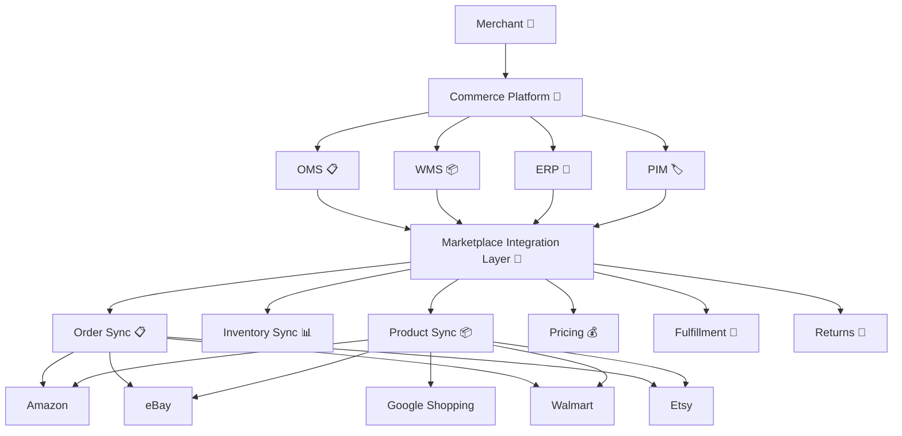
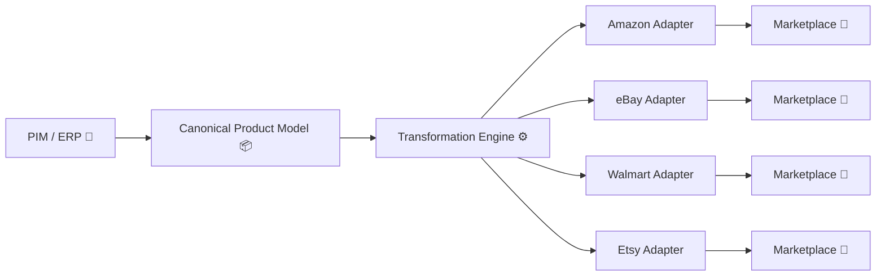

# Awesome-Marketplace-Integration-Platform

<a href="https://github.com/ishandutta2007/Awesome-Awesome-Awesome"></a><a href="https://discord.gg/jc4xtF58Ve"></a> <a href="https://github.com/ishandutta2007/Awesome-Marketplace-Integration-Platform/stargazers"></a> <a href="https://github.com/ishandutta2007/Awesome-Marketplace-Integration-Platform/network/members"></a> <a href="https://github.com/ishandutta2007"></a>


## 🛍️ Top Marketplace Integration Platforms & Open-Source Alternatives 🚀

> A curated list of **marketplace integration platforms, multichannel commerce software, product-feed management systems, order/inventory synchronization platforms and open-source alternatives** for selling across Amazon, eBay, Walmart, Etsy, Google Shopping, Shopify, regional marketplaces and other sales channels. 📦⚡

Marketplace integration platforms sit between a merchant's commerce stack and external sales channels, synchronizing products, listings, prices, inventory, orders, fulfillment and returns.

This repository focuses primarily on **open-source and self-hostable alternatives**, while maintaining a separate list of SaaS/hosted platforms such as ChannelEngine, Linnworks, Rithum (ChannelAdvisor), CedCommerce, Shoppingfeed, Channable, Pipe17, Zentail and API2Cart. 🌐

A typical marketplace integration layer looks like:

```text
                         MERCHANT 🏪
                            │
       ┌────────────────────┼────────────────────┐
       │                    │                    │
       ▼                    ▼                    ▼
      ERP                  PIM                  WMS
       │                    │                    │
       └────────────────────┼────────────────────┘
                            │
                            ▼
                  MARKETPLACE INTEGRATION 🔄
                            │
          ┌─────────────────┼─────────────────┐
          │                 │                 │
          ▼                 ▼                 ▼
       Amazon             eBay            Walmart
          │                 │                 │
          ▼                 ▼                 ▼
       Orders            Orders            Orders
          │                 │                 │
          └─────────────────┼─────────────────┘
                            ▼
                       OMS / ERP 📦
```

Modern channel managers typically act as middleware between a merchant's ERP, OMS, PIM, WMS or webstore and marketplaces, keeping product, price, inventory, fulfillment and order information synchronized. ChannelEngine's current documentation describes this middleware role explicitly, while its Channel API supports products, orders, shipments, cancellations and returns.

---

## 📑 Table of Contents

* [☁️ SaaS/Hosted Platforms](#️-saashosted-platforms)
* [🌍 Open-Source](#-open-source)
* [🔄 Open-Source Marketplace Orchestration](#-open-source-marketplace-orchestration)
* [🛒 Open-Source E-Commerce Platforms](#-open-source-e-commerce-platforms)
* [📦 Open-Source Product & Catalog Management](#-open-source-product--catalog-management)
* [🔌 Open-Source Integration & Automation](#-open-source-integration--automation)
* [📡 Open-Source Marketplace & Channel Connectors](#-open-source-marketplace--channel-connectors)
* [📋 Open-Source Product Feed Management](#-open-source-product-feed-management)
* [📦 Open-Source Order & Inventory Management](#-open-source-order--inventory-management)
* [🚚 Open-Source Shipping & Fulfillment](#-open-source-shipping--fulfillment)
* [🧾 Open-Source ERP & Commerce Backends](#-open-source-erp--commerce-backends)
* [🧩 Commercial Platform → Open-Source Equivalent](#-commercial-platform--open-source-equivalent)
* [🏗️ Marketplace Integration Architecture](#️-marketplace-integration-architecture)
* [🔄 Open-Source Multichannel Architecture](#-open-source-multichannel-architecture)
* [📦 Product Synchronization Architecture](#-product-synchronization-architecture)
* [📋 Order Synchronization Architecture](#-order-synchronization-architecture)
* [⚖️ Commercial vs Open-Source](#️-commercial-vs-open-source)
* [🚀 Recommended Open-Source Stacks](#-recommended-open-source-stacks)
* [📊 Marketplace Integration Comparison](#-marketplace-integration-comparison)
* [🎯 Recommended Projects by Use Case](#-recommended-projects-by-use-case)
* [🏢 Building a ChannelEngine Alternative](#-building-a-channelengine-alternative)
* [🏪 Building a Multichannel Commerce Platform](#-building-a-multichannel-commerce-platform)
* [🌐 Open-Source Marketplace Integration Landscape](#-open-source-marketplace-integration-landscape)
* [🧠 Why Open-Source Marketplace Integration Matters](#-why-open-source-marketplace-integration-matters)
* [💖 Support & Community](#-support--community)
* [📈 Star History](#-star-history)
* [🤝 Contributing](#-contributing)
* [⚠️ Disclaimer](#️-disclaimer)

---

# ☁️ SaaS/Hosted Platforms 🌐

> 📊 **Market Insights:** The global marketplace integration and multichannel e-commerce software market is estimated at **$6.2 Billion (2026)** and is **moderately fragmented**, with key consolidated enterprise leaders (e.g., Mirakl, Rithum, Salsify) operating alongside agile specialized feed managers and channel adapters.

Commercial marketplace integration platforms provide prebuilt connectors, catalog synchronization, order management, inventory synchronization, marketplace listing management and feed automation.

| Platform | Company | Primary Focus | Company Size / Valuation | Starting Price | Free Tier / Trial Limit | Key Capabilities |
| :--- | :--- | :--- | :--- | :--- | :--- | :--- |
| [Mirakl Connect](https://www.mirakl.com/) | Mirakl | Marketplace ecosystem | $3.5B Valuation | $1,500/mo base | 14-day trial (Partner sandbox access) | Marketplace connections, catalog, orders and seller connectivity |
| [Rithum](https://www.rithum.com/) | Rithum | Multichannel commerce | $2.0B Valuation | $1,200/mo base | 14-day trial (Demo sandbox environment) | Marketplace connectivity, product data, orders, inventory and retail relationships |
| [ChannelAdvisor](https://www.channeladvisor.com/) | Rithum | Marketplace management | $1.8B Valuation | $1,000/mo base | 14-day trial (Demo sandbox environment) | Marketplace listings, orders, inventory, feeds and commerce automation |
| [Salsify](https://www.salsify.com/) | Salsify | Product experience | $1.5B Valuation | $800/mo base | 14-day trial (Product content sandbox) | Product content, syndication and digital shelf management |
| [Akeneo](https://www.akeneo.com/) | Akeneo | PIM | $400M Valuation | $500/mo base | Free forever Community Edition (Self-hosted) | Product information management and channel syndication |
| [Feedonomics](https://feedonomics.com/) | BigCommerce | Feed management | $145M Acquisition | $199/mo base | 14-day trial (Feed audit and setup preview) | Product feeds and channel optimization |
| [ChannelEngine](https://www.channelengine.net/) | ChannelEngine | Marketplace management | $200M Valuation | $499/mo base | 14-day trial (Limited to 100 test sync orders) | Product listings, inventory, orders, pricing, fulfillment and marketplace integrations |
| [Linnworks](https://www.linnworks.com/) | Linnworks | Multichannel commerce | $150M Valuation | $399/mo base | 14-day trial (Up to 50 test orders) | Inventory, orders, fulfillment, warehouse and marketplace management |
| [Channable](https://www.channable.com/) | Channable | Feed & marketplace automation | $80M Valuation | $39/mo base | Free forever plan (up to 100 products across feeds) | Product feeds, marketplace integrations, PPC automation and rules |
| [Productsup](https://www.productsup.com/) | Productsup | Product-to-consumer | $70M Valuation | $450/mo base | 14-day trial (Catalog feed upload preview) | Product data, feeds, marketplaces and commerce channels |
| [Lengow](https://www.lengow.com/) | Lengow | Ecommerce feed management | $50M Valuation | $199/mo base | 14-day trial (1 sales channel feed preview) | Marketplace, comparison-shopping and advertising channels |
| [Zentail](https://www.zentail.com/) | Zentail | Multichannel commerce | $40M Valuation | $850/mo base | 14-day trial (Catalog mapping test environment) | Listings, catalog, inventory, orders and marketplace management |
| [Pipe17](https://pipe17.com/) | Pipe17 | Commerce connectivity | $30M Valuation | $299/mo base | 14-day trial (100 order flow executions) | Orders, products, inventory, fulfillment and ERP/commerce integrations |
| [CedCommerce](https://cedcommerce.com/) | CedCommerce | Marketplace integrations | $25M Valuation | $49/mo base | Free forever plan (up to 50 orders/mo on select connectors) | Marketplace connectors for ecommerce platforms and sellers |
| [BaseLinker](https://baselinker.com/) | BaseLinker | Multichannel commerce | $20M Valuation | $12/mo base | 14-day trial (Up to 100 orders & 1000 listings) | Marketplace, ecommerce, inventory and order management |
| [Shoppingfeed](https://www.shoppingfeed.com/) | Shoppingfeed | Product feeds | $15M Valuation | $119/mo base | 14-day trial (Single channel connection preview) | Marketplace and shopping-channel feed management |
| [API2Cart](https://api2cart.com/) | API2Cart | Ecommerce integration API | $10M Valuation | $99/mo base | 30-day trial (Up to 5,000 API calls) | Unified API for ecommerce platforms |
| [ChannelDock](https://www.channeldock.com/) | ChannelDock | Multichannel selling | $5M Valuation | $29/mo base | Free forever plan (up to 50 orders/mo) | Marketplace synchronization and order management |

Mirakl Connect provides a unified API for managing products, inventories, orders and shipments across connected Mirakl-powered stores. ⚡

ChannelEngine's API similarly supports marketplace/channel synchronization around products, orders, shipments, cancellations and returns. 🔄

---

# 🌍 Open-Source 🔓

There is currently no single dominant open-source project that reproduces the entire feature set of a mature platform such as ChannelEngine, Linnworks or Rithum.

Instead, an open-source marketplace integration platform can be assembled from:

```text
                 OPEN-SOURCE MULTICHANNEL COMMERCE 🛠️
                              │
        ┌─────────────────────┼─────────────────────┐
        │                     │                     │
        ▼                     ▼                     ▼
     Catalog               Products             Inventory
        │                     │                     │
        └─────────────────────┼─────────────────────┘
                              │
                              ▼
                    Marketplace Connectors 🔌
                              │
          ┌───────────────────┼───────────────────┐
          ▼                   ▼                   ▼
       Amazon               eBay               Walmart
          │                   │                   │
          └───────────────────┼───────────────────┘
                              ▼
                           Orders 📋
                              │
                              ▼
                         Fulfillment 🚚
                              │
                              ▼
                         Accounting 🧾
```

The strongest direct open-source project identified for this category is **OpenLinker**, a self-hosted, API-first marketplace orchestration platform designed specifically to synchronize products, inventory and orders across shops and marketplaces. It is currently alpha/pre-1.0 and uses an Apache-2.0 license.

---

# 🔄 Open-Source Marketplace Orchestration 🛠️

## OpenLinker <a href="https://github.com/openlinker-project/openlinker/stargazers"></a>

[OpenLinker](https://github.com/openlinker-project/openlinker) is currently one of the closest open-source projects to the **channel-manager / marketplace-orchestration** category.

It provides:

* Product synchronization 📦
* Inventory synchronization 📊
* Order synchronization 📋
* Marketplace listings 🏷️
* Shipping integrations 🚚
* Multiple stores 🏬
* Marketplace adapters 🔌
* Plugin-based integrations 🧩
* OAuth connections 🔑
* Credential management 🛡️
* Retry handling 🔄
* Webhooks 📡
* Self-hosting 🏠

Current integrations include PrestaShop, WooCommerce, Allegro and Erli, with additional integrations such as Shopify, BigCommerce, Magento, Amazon and eBay listed on its roadmap.

```text
                         OpenLinker 🔄
                              │
               ┌──────────────┼──────────────┐
               │              │              │
               ▼              ▼              ▼
           Products       Inventory         Orders
               │              │              │
               └──────────────┼──────────────┘
                              │
                   ┌──────────┴──────────┐
                   ▼                     ▼
                Shops              Marketplaces
                   │                     │
           ┌───────┼───────┐       ┌────┼────┐
           ▼       ▼       ▼       ▼         ▼
       PrestaShop WooCommerce Allegro    Erli
```

OpenLinker explicitly positions itself as an alternative to SaaS channel managers and custom marketplace scripts, with a plugin architecture for adding new integrations. 🔌

---

# 🛒 Open-Source E-Commerce Platforms 🛍️

These platforms are not direct ChannelEngine replacements. Instead, they provide the **commerce system that marketplace integration software connects to**.

| Project | Stars | Description | Marketplace Relevance |
| :--- | :--- | :--- | :--- |
| [WooCommerce](https://github.com/woocommerce/woocommerce) | <a href="https://github.com/woocommerce/woocommerce/stargazers"></a> | Open-source ecommerce | Huge connector ecosystem |
| [Medusa](https://github.com/medusajs/medusa) | <a href="https://github.com/medusajs/medusa/stargazers"></a> | Headless commerce platform | API-first commerce backend |
| [Payload](https://github.com/payloadcms/payload) | <a href="https://github.com/payloadcms/payload/stargazers"></a> | TypeScript Headless CMS & Commerce | Extensible product schema & API |
| [Bagisto](https://github.com/bagisto/bagisto) | <a href="https://github.com/bagisto/bagisto/stargazers"></a> | Laravel ecommerce | Multi-channel integrations |
| [Saleor](https://github.com/saleor/saleor) | <a href="https://github.com/saleor/saleor/stargazers"></a> | GraphQL-native headless commerce | Native multichannel architecture |
| [Spree Commerce](https://github.com/spree/spree) | <a href="https://github.com/spree/spree/stargazers"></a> | Headless commerce | API-driven ecommerce |
| [PrestaShop](https://github.com/PrestaShop/PrestaShop) | <a href="https://github.com/PrestaShop/PrestaShop/stargazers"></a> | Open-source ecommerce | Marketplace integrations |
| [Sylius](https://github.com/Sylius/Sylius) | <a href="https://github.com/Sylius/Sylius/stargazers"></a> | Symfony ecommerce framework | Highly customizable commerce backend |
| [Vendure](https://github.com/vendurehq/vendure) | <a href="https://github.com/vendurehq/vendure/stargazers"></a> | TypeScript headless commerce | Multi-channel and marketplace support |
| [OpenCart](https://github.com/opencart/opencart) | <a href="https://github.com/opencart/opencart/stargazers"></a> | Open-source ecommerce | Marketplace extensions |
| [Shopware](https://github.com/shopware/shopware) | <a href="https://github.com/shopware/shopware/stargazers"></a> | Open commerce platform | Enterprise integrations |

Saleor is API-only, GraphQL-native and supports native multichannel concepts, making it particularly useful as the commerce backend underneath a custom marketplace integration layer. ⚡

Vendure similarly provides a plugin-first, TypeScript/GraphQL architecture with support for D2C, B2B, marketplace and omnichannel use cases. 🚀

Sylius is an open-source ecommerce framework built on Symfony with a REST API designed for integrations and customized commerce applications. 🛠️

---

# 📦 Open-Source Product & Catalog Management 🏷️

Marketplace integration requires a canonical product catalog.

| Project | Stars | Primary Role |
| :--- | :--- | :--- |
| [WooCommerce](https://github.com/woocommerce/woocommerce) | <a href="https://github.com/woocommerce/woocommerce/stargazers"></a> | Product catalog |
| [Medusa](https://github.com/medusajs/medusa) | <a href="https://github.com/medusajs/medusa/stargazers"></a> | Commerce catalog |
| [Saleor](https://github.com/saleor/saleor) | <a href="https://github.com/saleor/saleor/stargazers"></a> | Product catalog |
| [Pimcore](https://github.com/pimcore/pimcore) | <a href="https://github.com/pimcore/pimcore/stargazers"></a> | PIM / MDM / DAM |
| [Akeneo PIM](https://github.com/akeneo/pim-community-dev) | <a href="https://github.com/akeneo/pim-community-dev/stargazers"></a> | Product information management |
| [AtroCore](https://github.com/atrocore/atrocore) | <a href="https://github.com/atrocore/atrocore/stargazers"></a> | Data management and integration |
| [AtroPIM](https://github.com/atrocore/atropim) | <a href="https://github.com/atrocore/atropim/stargazers"></a> | Open-source PIM |

AtroPIM exposes a REST API that can connect to external systems, sales channels and marketplaces, and supports HTTP-based import/export integrations. 🌐

AtroCore likewise describes itself as an open-source data-management and system-integration platform with REST/GraphQL connectivity. 🔌

---

# 🔌 Open-Source Integration & Automation ⚡

A marketplace connector is essentially an integration problem:

```text
Marketplace API 📡
      │
      ▼
Authentication 🔑
      │
      ▼
Data Mapping 🗺️
      │
      ▼
Normalization ⚖️
      │
      ▼
Business Rules 📜
      │
      ▼
Canonical Commerce Model 🛒
```

Useful open-source integration engines include:

| Project | Stars | Description |
| :--- | :--- | :--- |
| [n8n](https://github.com/n8n-io/n8n) | <a href="https://github.com/n8n-io/n8n/stargazers"></a> | Workflow automation |
| [Apache Kafka](https://github.com/apache/kafka) | <a href="https://github.com/apache/kafka/stargazers"></a> | Event streaming |
| [Kestra](https://github.com/kestra-io/kestra) | <a href="https://github.com/kestra-io/kestra/stargazers"></a> | Workflow orchestration |
| [Activepieces](https://github.com/activepieces/activepieces) | <a href="https://github.com/activepieces/activepieces/stargazers"></a> | Open-source automation |
| [Node-RED](https://github.com/node-red/node-red) | <a href="https://github.com/node-red/node-red/stargazers"></a> | Event-driven integration |
| [Temporal](https://github.com/temporalio/temporal) | <a href="https://github.com/temporalio/temporal/stargazers"></a> | Durable workflow orchestration |
| [Airbyte](https://github.com/airbytehq/airbyte) | <a href="https://github.com/airbytehq/airbyte/stargazers"></a> | Open-source ELT data integration |
| [NATS](https://github.com/nats-io/nats-server) | <a href="https://github.com/nats-io/nats-server/stargazers"></a> | Messaging / eventing |
| [Windmill](https://github.com/windmill-labs/windmill) | <a href="https://github.com/windmill-labs/windmill/stargazers"></a> | Developer-oriented workflow platform |
| [Apache Camel](https://github.com/apache/camel) | <a href="https://github.com/apache/camel/stargazers"></a> | Enterprise integration framework |
| [Meltano](https://github.com/meltano/meltano) | <a href="https://github.com/meltano/meltano/stargazers"></a> | CLI for ELT pipelines & connectors |

These are **integration building blocks**, not turnkey marketplace channel managers. ⚙️

---

# 📡 Open-Source Marketplace & Channel Connectors 🔌

Marketplace connectors are often better treated as independent adapters.

```text
                   Canonical Product 📦
                          │
             ┌────────────┼────────────┐
             ▼            ▼            ▼
          Amazon         eBay        Walmart
             │            │            │
             ▼            ▼            ▼
          Adapter       Adapter      Adapter
             │            │            │
             └────────────┼────────────┘
                          ▼
                    Marketplace APIs 📡
```

Potential open-source connector foundations include:

| Project | Stars | Marketplace / Channel Capability |
| :--- | :--- | :--- |
| [WooCommerce](https://github.com/woocommerce/woocommerce) | <a href="https://github.com/woocommerce/woocommerce/stargazers"></a> | Connector ecosystem |
| [Medusa](https://github.com/medusajs/medusa) | <a href="https://github.com/medusajs/medusa/stargazers"></a> | Commerce integrations |
| [PrestaShop](https://github.com/PrestaShop/PrestaShop) | <a href="https://github.com/PrestaShop/PrestaShop/stargazers"></a> | Connector ecosystem |
| [Vendure](https://github.com/vendurehq/vendure) | <a href="https://github.com/vendurehq/vendure/stargazers"></a> | Plugin-based integrations |
| [AtroCore](https://github.com/atrocore/atrocore) | <a href="https://github.com/atrocore/atrocore/stargazers"></a> | Integration framework |
| [AtroPIM](https://github.com/atrocore/atropim) | <a href="https://github.com/atrocore/atropim/stargazers"></a> | Marketplace/channel integrations |
| [Saleor Apps](https://github.com/saleor/apps) | <a href="https://github.com/saleor/apps/stargazers"></a> | Commerce integrations |
| [OpenLinker](https://github.com/openlinker-project/openlinker) | <a href="https://github.com/openlinker-project/openlinker/stargazers"></a> | Marketplace/shop adapters |

Saleor's app architecture separates integrations from the core platform, with apps communicating through GraphQL and webhooks. 📡

---

# 📋 Open-Source Product Feed Management 📊

Product feeds are another important alternative to direct marketplace connectors.

```text
                  Product Catalog 📦
                         │
                         ▼
                    Feed Engine ⚙️
                         │
           ┌─────────────┼─────────────┐
           ▼             ▼             ▼
        Google         Amazon        Meta
        Shopping      Marketplace    Catalog
           │             │             │
           ▼             ▼             ▼
       XML/CSV/API    XML/CSV/API   XML/CSV/API
```

Useful components:

| Project | Stars | Role |
| :--- | :--- | :--- |
| [Pimcore](https://github.com/pimcore/pimcore) | <a href="https://github.com/pimcore/pimcore/stargazers"></a> | PIM / DAM / MDM |
| [Akeneo PIM](https://github.com/akeneo/pim-community-dev) | <a href="https://github.com/akeneo/pim-community-dev/stargazers"></a> | Product data |
| [AtroCore](https://github.com/atrocore/atrocore) | <a href="https://github.com/atrocore/atrocore/stargazers"></a> | Data integration |
| [AtroPIM](https://github.com/atrocore/atropim) | <a href="https://github.com/atrocore/atropim/stargazers"></a> | Product data management |
| [Saleor Apps](https://github.com/saleor/apps) | <a href="https://github.com/saleor/apps/stargazers"></a> | Product feed integrations |
| [OpenLinker](https://github.com/openlinker-project/openlinker) | <a href="https://github.com/openlinker-project/openlinker/stargazers"></a> | Listing/orchestration layer |

---

# 📦 Open-Source Order & Inventory Management 📊

A marketplace integration system must synchronize state in both directions.

```text
Marketplace 🏪
    │
    │ Orders 📋
    ▼
Integration Layer 🔄
    │
    ▼
OMS / ERP 💼
    │
    │ Inventory 📊
    ▼
Integration Layer 🔄
    │
    ▼
Marketplace 🏪
```

Useful projects:

| Project | Stars | Role |
| :--- | :--- | :--- |
| [Odoo](https://github.com/odoo/odoo) | <a href="https://github.com/odoo/odoo/stargazers"></a> | Inventory + ERP |
| [ERPNext](https://github.com/frappe/erpnext) | <a href="https://github.com/frappe/erpnext/stargazers"></a> | Inventory + ERP |
| [Medusa](https://github.com/medusajs/medusa) | <a href="https://github.com/medusajs/medusa/stargazers"></a> | Orders + inventory |
| [Saleor](https://github.com/saleor/saleor) | <a href="https://github.com/saleor/saleor/stargazers"></a> | Orders + inventory |
| [WooCommerce](https://github.com/woocommerce/woocommerce) | <a href="https://github.com/woocommerce/woocommerce/stargazers"></a> | Orders + inventory |
| [PrestaShop](https://github.com/PrestaShop/PrestaShop) | <a href="https://github.com/PrestaShop/PrestaShop/stargazers"></a> | Orders + inventory |
| [Vendure](https://github.com/vendurehq/vendure) | <a href="https://github.com/vendurehq/vendure/stargazers"></a> | Orders + inventory |
| [OpenLinker](https://github.com/openlinker-project/openlinker) | <a href="https://github.com/openlinker-project/openlinker/stargazers"></a> | Orders + inventory + listings |

OpenLinker's current architecture explicitly models catalog/inventory, orders and marketplace offers as separate capabilities implemented by integration plugins. 🔌

---

# 🚚 Open-Source Shipping & Fulfillment 📦

Marketplace platforms frequently need to synchronize:

* Shipments 🚢
* Tracking numbers 🏷️
* Shipping services 🚚
* Fulfillment status ✅
* Returns 🔄
* Shipping labels 📄

Useful open-source components:

| Project | Stars | Role |
| :--- | :--- | :--- |
| [Odoo](https://github.com/odoo/odoo) | <a href="https://github.com/odoo/odoo/stargazers"></a> | Logistics |
| [ERPNext](https://github.com/frappe/erpnext) | <a href="https://github.com/frappe/erpnext/stargazers"></a> | Fulfillment / inventory |
| [Medusa](https://github.com/medusajs/medusa) | <a href="https://github.com/medusajs/medusa/stargazers"></a> | Fulfillment |
| [Saleor](https://github.com/saleor/saleor) | <a href="https://github.com/saleor/saleor/stargazers"></a> | Shipping |
| [Vendure](https://github.com/vendurehq/vendure) | <a href="https://github.com/vendurehq/vendure/stargazers"></a> | Shipping |
| [InvenTree](https://github.com/inventree/InvenTree) | <a href="https://github.com/inventree/InvenTree/stargazers"></a> | Open-source inventory & stock management |
| [OpenBoxes](https://github.com/openboxes/openboxes) | <a href="https://github.com/openboxes/openboxes/stargazers"></a> | Inventory / logistics |
| [OpenLinker](https://github.com/openlinker-project/openlinker) | <a href="https://github.com/openlinker-project/openlinker/stargazers"></a> | Shipping adapters |

OpenLinker currently includes shipping capabilities through integrations such as InPost and DPD, alongside marketplace/shop synchronization. 📦

---

# 🧾 Open-Source ERP & Commerce Backends 💼

An ERP frequently becomes the **system of record** underneath a channel manager.

| Project | Stars | Focus |
| :--- | :--- | :--- |
| [Odoo Community](https://github.com/odoo/odoo) | <a href="https://github.com/odoo/odoo/stargazers"></a> | ERP / inventory / commerce |
| [ERPNext](https://github.com/frappe/erpnext) | <a href="https://github.com/frappe/erpnext/stargazers"></a> | ERP / inventory / accounting |
| [Dolibarr](https://github.com/Dolibarr/dolibarr) | <a href="https://github.com/Dolibarr/dolibarr/stargazers"></a> | ERP / CRM |
| [Apache OFBiz](https://github.com/apache/ofbiz-framework) | <a href="https://github.com/apache/ofbiz-framework/stargazers"></a> | Enterprise commerce / ERP |
| [iDempiere](https://github.com/idempiere/idempiere) | <a href="https://github.com/idempiere/idempiere/stargazers"></a> | ERP / CRM |
| [Tryton](https://github.com/tryton/tryton) | <a href="https://github.com/tryton/tryton/stargazers"></a> | ERP framework |

---

# 🧩 Commercial Platform → Open-Source Equivalent

| Commercial Platform | Open-Source Equivalent / Building Blocks |
| :--- | :--- |
| **ChannelEngine** | OpenLinker + Saleor/Vendure/Medusa + PIM |
| **Linnworks** | OpenLinker + ERPNext/Odoo + inventory + fulfillment |
| **Rithum / ChannelAdvisor** | OpenLinker + AtroPIM + ERP/OMS |
| **CedCommerce** | OpenLinker + ecommerce-platform plugins + marketplace adapters |
| **Shoppingfeed** | AtroPIM + feed engine + marketplace adapters |
| **Channable** | AtroPIM + Apache Camel/n8n + feed-generation layer |
| **Pipe17** | OpenLinker + Apache Camel + event-driven integration |
| **Zentail** | OpenLinker + PIM + OMS + marketplace adapters |
| **API2Cart** | Unified API layer + ecommerce adapters |
| **Feedonomics** | AtroPIM/Pimcore + feed engine + channel adapters |
| **Productsup** | AtroPIM/Pimcore + feed transformation + integration workflows |
| **Lengow** | PIM + feed engine + marketplace adapters |
| **BaseLinker** | OpenLinker + ERPNext/Odoo + marketplace plugins |
| **Mirakl Connect** | OpenLinker + marketplace connector framework |
| **Marketplace Channel Manager** | OpenLinker + PIM + OMS |
| **Multichannel Inventory Platform** | OpenLinker + ERPNext/Odoo |
| **Marketplace Feed Platform** | AtroPIM + Apache Camel + feed processors |
| **Commerce Integration API** | API gateway + connector/adaptor layer |
| **Full Open-Source Stack** | OpenLinker + AtroPIM + ERPNext + Saleor/Vendure |

> These mappings are **architectural equivalents**, not claims that the open-source projects provide identical marketplace coverage or commercial integrations.

---

# 🏗️ Marketplace Integration Architecture 🏛️



---

# 🔄 Open-Source Multichannel Architecture ⚡

```text
                         MERCHANT 🏪
                            │
                            ▼
                    ┌──────────────┐
                    │  OpenLinker  │
                    └───────┬──────┘
                            │
              ┌─────────────┼─────────────┐
              │             │             │
              ▼             ▼             ▼
          Products      Inventory       Orders
              │             │             │
              └─────────────┼─────────────┘
                            │
         ┌──────────────────┼──────────────────┐
         ▼                  ▼                  ▼
      Amazon              eBay              Walmart
         │                  │                  │
         └──────────────────┼──────────────────┘
                            │
                            ▼
                         ERP / OMS 💼
```

---

# 📦 Product Synchronization Architecture 🏷️



The critical design principle is to maintain **one canonical product model** rather than storing marketplace-specific product representations as the primary source of truth.

---

# 📋 Order Synchronization Architecture 🚚

```text
Amazon Order 📋
     │
     ▼
Amazon Adapter
     │
     ▼
Normalize Order ⚖️
     │
     ▼
Canonical Order Model
     │
     ▼
OMS / ERP 💼
     │
     ▼
Fulfillment 📦
     │
     ▼
Shipment 🚚
     │
     ▼
Marketplace Adapter
     │
     ▼
Amazon
```

This pattern should be repeated independently for:

* eBay
* Walmart
* Etsy
* Regional marketplaces
* Social-commerce channels
* D2C stores

---

# 💰 Inventory Synchronization 📊

Inventory synchronization is one of the most important channel-manager functions.

```text
                         MASTER STOCK 📊
                               │
                ┌─────────────┼─────────────┐
                │             │             │
                ▼             ▼             ▼
             Amazon         eBay          Walmart
             100 units      100 units      100 units
                │             │             │
                ▼             ▼             ▼
             Sale          Sale           Sale
                │             │             │
                └─────────────┼─────────────┘
                              ▼
                         Stock Events ⚡
                              │
                              ▼
                      Inventory Service ⚙️
                              │
                              ▼
                         Recalculate 🔄
                              │
                ┌─────────────┼─────────────┐
                ▼             ▼             ▼
             Amazon         eBay          Walmart
```

A production implementation should include:

* Idempotency
* Event ordering
* Retry queues
* Rate-limit handling
* Stock reservations
* Safety stock
* Inventory reconciliation
* Marketplace-specific quantity rules
* Failure recovery

---

# ⚙️ Marketplace Adapter Architecture 🔌

A scalable connector system should avoid hard-coding each marketplace directly into the core application.

```text
                     Integration Core ⚙️
                            │
                     Adapter Interface 🔌
                            │
        ┌───────────────────┼───────────────────┐
        │                   │                   │
        ▼                   ▼                   ▼
    Amazon Adapter      eBay Adapter       Walmart Adapter
        │                   │                   │
        ▼                   ▼                   ▼
    Amazon API          eBay API           Walmart API
```

Each adapter can implement interfaces such as:

```text
ProductReader
ProductWriter
InventoryReader
InventoryWriter
OrderReader
OrderWriter
ShipmentWriter
ReturnReader
CategoryReader
ListingManager
PriceManager
```

This is very close to the architecture used by OpenLinker, where integrations implement typed capability ports rather than requiring changes to the core orchestration engine.

---

# 🔌 Canonical Commerce Data Model 📦

A marketplace integration platform benefits from canonical entities:

```text
Product 📦
 ├── SKU
 ├── Title
 ├── Description
 ├── Brand
 ├── GTIN
 ├── Images
 ├── Attributes
 ├── Categories
 └── Variants

Inventory 📊
 ├── SKU
 ├── Location
 ├── Available
 ├── Reserved
 └── Safety Stock

Order 📋
 ├── Order ID
 ├── Customer
 ├── Line Items
 ├── Payment
 ├── Shipping
 ├── Fulfillment
 └── Status
```

Marketplace-specific adapters then translate this canonical model into the schemas required by each channel. 🌐

---

# 🧠 Marketplace Data Transformation ⚙️

```text
                    Canonical Product 📦
                           │
                           ▼
                    Rules Engine ⚙️
                           │
        ┌──────────────────┼──────────────────┐
        ▼                  ▼                  ▼
      Amazon              eBay             Walmart
        │                  │                  │
        ▼                  ▼                  ▼
 Category Mapping      Category Mapping   Category Mapping
 Attribute Mapping     Attribute Mapping  Attribute Mapping
 Title Rules            Title Rules        Title Rules
 Image Rules            Image Rules        Image Rules
```

This is one of the main areas where commercial platforms differentiate themselves: marketplace-specific schemas, category mappings, attributes, validation rules and operational workflows. 🛠️

---

# ⚖️ Commercial vs Open-Source 📊

| Capability | SaaS Marketplace Platform | Open-Source Stack |
| :--- | :--- | :--- |
| Marketplace Connectors | ✅ Large catalog | ⚠️ Build / community |
| Product Sync | ✅ | ✅ |
| Inventory Sync | ✅ | ✅ |
| Order Sync | ✅ | ✅ |
| Listing Management | ✅ | ✅ / Build |
| Feed Management | ✅ | ✅ / Build |
| Category Mapping | ✅ | Build |
| Attribute Mapping | ✅ | Build |
| Pricing Rules | ✅ | Build |
| Fulfillment | ✅ | ✅ |
| Returns | ✅ | Build |
| ERP Integration | ✅ | ✅ |
| PIM Integration | ✅ | ✅ |
| Webhooks | ✅ | ✅ |
| Rate-Limit Handling | Managed | Build |
| API Changes | Vendor-managed | Self-managed |
| Retry Infrastructure | Built-in | Build |
| Data Ownership | Vendor-dependent | Full control |
| Self Hosting | Usually ❌ | ✅ |
| Source Code | Proprietary | ✅ |
| Customization | Medium | Very High |
| Vendor Lock-In | Higher | Lower |
| Time to Market | Fast | Slower |
| Operational Complexity | Lower | Higher |
| Marketplace Coverage | Usually broad | Varies significantly |
| Cost Model | Subscription / usage | Infrastructure + engineering |

---

# 📊 Marketplace Integration Comparison 📈

| Project | Marketplace Orchestration | Product Sync | Inventory | Orders | PIM | ERP | Self-Host |
| :--- | :---: | :---: | :---: | :---: | :---: | :---: | :---: |
| **OpenLinker** | ✅ | ✅ | ✅ | ✅ | ⚠️ | ⚠️ | ✅ |
| **Saleor** | ⚠️ | ✅ | ✅ | ✅ | ⚠️ | ⚠️ | ✅ |
| **Vendure** | ⚠️ | ✅ | ✅ | ✅ | ⚠️ | ⚠️ | ✅ |
| **Medusa** | ⚠️ | ✅ | ✅ | ✅ | ⚠️ | ⚠️ | ✅ |
| **Sylius** | ⚠️ | ✅ | ✅ | ✅ | ⚠️ | ⚠️ | ✅ |
| **WooCommerce** | ⚠️ | ✅ | ✅ | ✅ | ⚠️ | ⚠️ | ✅ |
| **PrestaShop** | ⚠️ | ✅ | ✅ | ✅ | ⚠️ | ⚠️ | ✅ |
| **AtroPIM** | ⚠️ | ✅ | ⚠️ | ❌ | ✅ | ✅ | ✅ |
| **AtroCore** | ⚠️ | ✅ | ⚠️ | ⚠️ | ✅ | ✅ | ✅ |
| **ERPNext** | ⚠️ | ✅ | ✅ | ✅ | ⚠️ | ✅ | ✅ |
| **Odoo Community** | ⚠️ | ✅ | ✅ | ✅ | ⚠️ | ✅ | ✅ |
| **Open Marketplace** | ⚠️ | ✅ | ⚠️ | ✅ | ⚠️ | ⚠️ | ✅ |

> `⚠️` means the project can participate in or support the workflow but is not necessarily a direct, turnkey replacement for a commercial multichannel platform.

---

# 🎯 Recommended Projects by Use Case 🚀

| Use Case | Recommended Starting Point |
| :--- | :--- |
| Closest open-source channel manager | **OpenLinker** |
| Marketplace + existing stores | **OpenLinker** |
| Headless multichannel commerce | **Saleor** |
| TypeScript commerce backend | **Vendure** |
| Fast TypeScript commerce development | **Medusa** |
| PHP/Symfony commerce | **Sylius** |
| WordPress ecosystem | **WooCommerce** |
| Large plugin ecosystem | **PrestaShop** |
| Product information management | **Akeneo / AtroPIM** |
| Open-source PIM + integrations | **AtroPIM** |
| Data integration layer | **AtroCore / Apache Camel** |

---

# 💖 Support & Community 🌟

Thank you for exploring this curated guide to **Awesome Marketplace Integration Platforms & Open-Source Alternatives**! 💖

If you found this resource helpful, please consider:
- ⭐ **Starring** this repository on GitHub
- 🔀 **Forking** it to customize or contribute updates
- 📢 **Sharing** it with your developer and e-commerce seller network!

[](https://github.com/sponsors/ishandutta2007)

---

## 📈 Star History

[](https://star-history.dera.page/#ishandutta2007/Awesome-Marketplace-Integration-Platform&type=date&legend=top-left)

---

# 🤝 Contributing 🤲

Contributions are welcome! Please feel free to submit a pull request with new open-source projects, SaaS channel connectors, architecture diagrams, or integration patterns.

---

# ⚠️ Disclaimer 🛡️

Marketplace integration capabilities change frequently because external marketplaces continuously modify:

* APIs
* Authentication
* Product schemas
* Category taxonomies
* Listing requirements
* Rate limits
* Order APIs
* Fulfillment APIs
* Return workflows

A self-hosted marketplace integration platform therefore requires ongoing engineering and maintenance.

Open-source software also does not automatically provide access to proprietary marketplace APIs or commercial marketplace partner programs.

Always verify:

* Marketplace API terms
* Partner requirements
* Rate limits
* Commercial usage policies
* Data-processing requirements
* Project licenses
* Dependency licenses
* Connector licenses
* Marketplace-specific certification requirements

before deploying a production integration.

---

## ⭐ Star This Repository 🌟

If you are interested in:

* Marketplace Integration 🔄
* Multichannel Commerce 🛍️
* Channel Management 🏬
* Product Feeds 📊
* Marketplace APIs 📡
* Ecommerce Infrastructure ⚙️
* PIM 🏷️
* OMS 📋
* Inventory Synchronization 📊
* Open-Source Commerce 🔓
* Headless Commerce ⚡
* Embedded Commerce 🔌

consider giving this repository a ⭐ **Star** and contributing new projects.

---

**Last updated: September 2026** 📅
